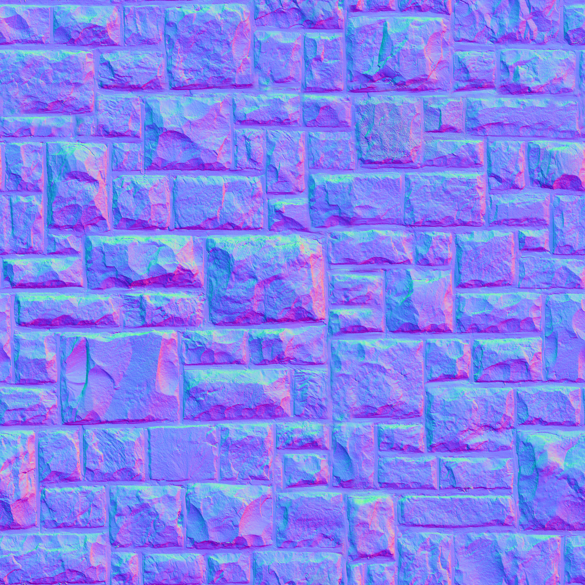
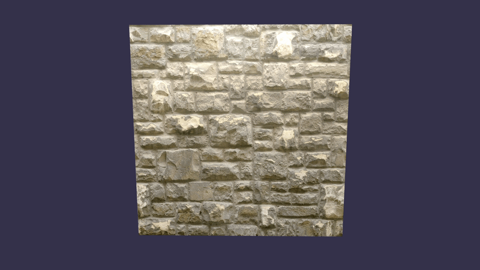
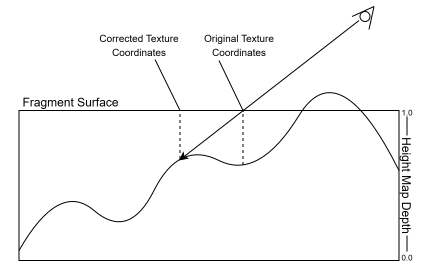
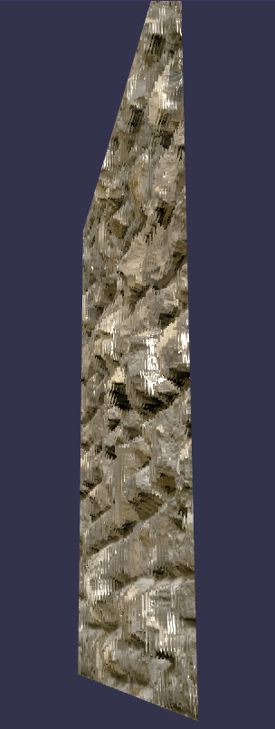
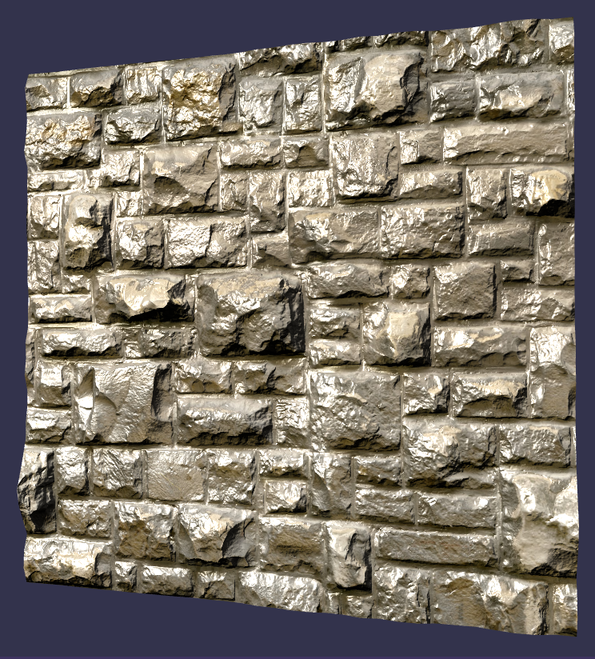
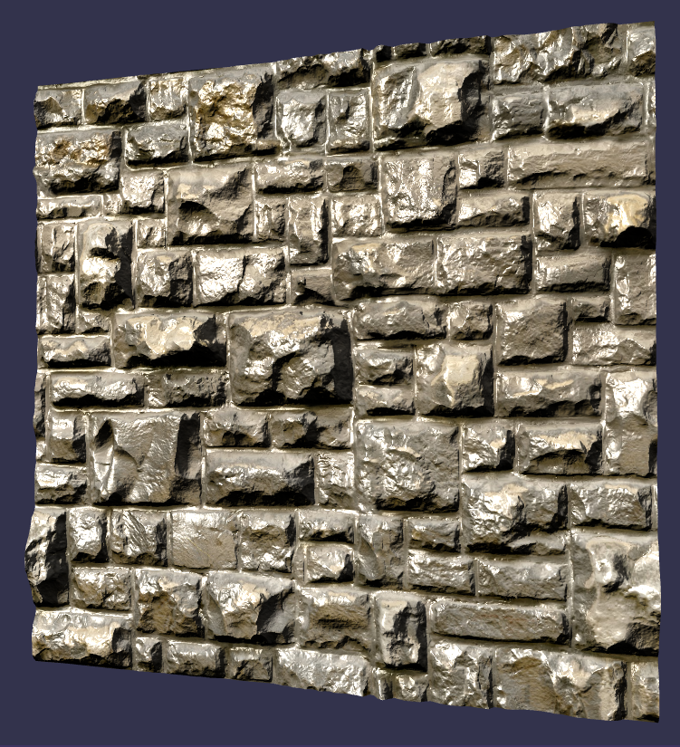

# Introduction

This term we have generated many fantastic scenes. Lighting has proved to be a fantastic way to give realism to our scenes. We then added textures to the mix to make everything *pop*! But, our scenes still feel very *flat*.

This is because all the objects we have used have been fairly simple geometric shapes. Their surfaces have been entirely flat. The brick floor we produced in our [Textures](../week_7/textures.md) lesson was perfectly *smooth*. How can we make a brick surface actually look *physically* textured?

One way would be to simply create a highly detailed mesh, perhaps using a 3D scanner. This would result in millions of triangles, each with their own surface normals, which would result in very accurate lighting effects. It would also allow one part of the surface to *occlude* (or "block") other parts based on their height differences and the camera's viewing angle.

While this would be the *perfect* solution, it also is unrealistic. Having the floor modeled with *millions* of triangles would require significant GPU resources. Now consider that the floor is just a tiny piece of any scene, and if we were to model *every* object with the same fidelity, then our GPU would grind to a halt (or melt).

So, how *does* one make a flat surface seem non-flat, while maintaining performance?

Shaders. The answer is shaders. Let's look at a few techniques that can be used to give *depth* to our object's textures.

# Bump Mapping

This is one of the very first "oooh, ahhhh" techniques I remember seeing implemented in a video game. Most people remember *Halo: Combat Evolved* (2001) as their first introduction to this technique, but it takes back much further. It was "invented" by James Blinn (who created Blinn-Phong Shading) in 1978.

The technique is satisfyingly simple. Along with the *diffuse* texture[^1], a grayscale *height map* texture is sent to the shader. It contains values between 0.0 (black) and 1.0 (white), which represent height. These heights, will be used to *perturb* the surface normals of our object to give the *impression* of depth.[^2]

Remember, it is the surface *normals* that our lighting algorithm uses to calculate shading. Therefore, if you manipulate the normals, you can change how the light behaves. This allowed for surfaces to appear contoured while remaining completely flat.

# Normal Mapping

Whereas *Bump Mapping* required the shader to calculate new surface normals based on the height map, *Normal Mapping* "pre-bakes" this data directly into a texture. It is actually *genius* once you realize how it works.

How do we store color data in our applications and shaders?

**HIDE ANSWER: We typically store them as a `vec3`: one element for Red, Blue, and Green values.**

How do we store *normals*?

**HIDE ANSWER: We store them as a `vec3`. It was a leading question, I know, but good job!**

So, back in 1996, Venkat Kirshnamurthy and Marc Levoy developed a technique where surface normals could be encoded into RGB values of a texture. They used the technique to convert high-poly count meshes into a combination of a lower-poly count mesh and a *Normal Map*. Let's take a look at a *Normal Map* of a brick wall.

Pretty trippy right? If you were to download this file and *decompose* it into RGB layers, you would see that each color layer has a slightly different image. The RGB values at each texel represent the X, Y, and Z values of a normal vector. When combined with a *diffuse texture*, a *normal map* is a super efficient way of "faking" depth.

Take a look at the two walls below and see the difference.

|Diffuse|Diffuse + Normal|
|--|--|
|||

Notice how the *diffuse* only wall is super flat. You can really see the flatness when viewing at a sharp angle as the light creates a sheen. This flatness really ruins otherwise solid lighting.

The *diffuse + normal* wall looks a thousand times better. The specular highlighting realistically changes across the surface of each brick. The *normal map* will behave correctly no matter which direction the light is coming from.

Can you identify one of the shortcomings of using a *normal map*?

**HIDE ANSWER: If you look at the edge of the wall as it pivots toward you, you can see that there is no *real* depth. It is still just a flat surface. *Normal maps* can't change the "silhouette" of a surface.**

This shortcoming isn't a huge deal as long as the camera doesn't get too close and at a sharp angle.

# Parallax Mapping

If you look even closer at the *normal map* wall, you may notice that none of the bricks "occlude" or "block" the camera from seeing the bricks behind. This means the entire texture is visible at all times.

This isn't as realistic as some would like so Tomomichi Kaneko introduced *Parallax Mapping* in 2001. The technique builds off of *normal mapping*. Like *normal mapping*, *parallax mapping* encodes surface normals in RGB data. The difference is that it also uses a *height map*. This could be a separate texture, but is typically encoded using an RGBA format.

In this scenario, the grayscale height map data is stored in the "alpha" slot of the RGBA format. It then uses this height information to determine the *best* texture coordinates to use for a given fragment. Let's look at a diagram to better understand the process.

As we have seen before, a vector is drawn from the camera/eye until it hits a fragment. The intersection of the vector and the fragment is used to calculate `st`, which in turn is used to retrieve a texel from a texture image. The diagram shows that this simple approach is flawed and wouldn't return the *ideal* `st` coordinates.

*Parallax mapping* extends (or reduces) the camera vector so that it terminates on the height map. This *new* `st` value is then used to *perturb* our texture lookup. Remember, all of this happens in the shader. Like I said, *genius*! Let's see it in action and compare it to *Normal Mapping*.

|Diffuse + Normal | Diffuse + Parallax |
|--|--|
|||

Notice how the bricks really *pop* out of the surface. Not only does the lighting look more realistic (cracks are deeper, and it mimics self-shadowing), but the larger bricks *occlude* those behind them. *Parallax mapping* is also completely flat (look at the edges as it turns). I personally also think it looks a bit like the texture is *below* the actual surface.

This technique is *very* effective at making textures have depth, but it isn't perfect. If you view the surface at an extreme angle, you may see some texture flickering. The surface will look like a series of topological layers:

Still, in most instances, *parallax mapping* is more than adequate for surfaces that are only going to be viewed from a distance. They are not suited for anything that requires an actual silhouette.

# Displacement Mapping

As we mentioned, all the above techniques still result in a *flat* surface. This means that shadows won't be completely accurate. It also means that any surface that finds itself silhouetted will immediately give away the fakery.

The only way to avoid these drawbacks is to actually manipulate the vertices themselves. You could do this by creating high-poly count models and swapping them in when you get close enough that it matters, but those take up a lot of memory. Another solution is to use *Displacement Maps*.

*Displacement maps* are pretty much the same thing as the *bump maps* we saw before (a grayscale height map). But, this time, they don't manipulate normals to affect lighting. *Displacement maps* perturb the vertices themselves! This means that the shaders themselves actually modify the vertices of the objects in real-time.

This means that any lighting in the scene behaves *exactly* as you would expect (no trickier!). The self-shadowing is *perfect*. The edges of the model actual become contoured, resulting in a realistic silhouette. Let's take a look!

|Diffuse + Parallax|Diffuse + Displacement|
|--|--|
|||

The first thing you should look at are the edges of the wall. You can see that the vertices have actually been *displaced* to create new geometry. No matter how close you get to it, the bricks will remain 3D dimensional. Everything is more realistic!

So, why don't we just use *displacement mapping* all the time? Any guesses?

**HIDE ANSWER: There is a decent amount of overhead added when using *displacement mapping*. One, you have to update the normals after moving the vertices or the lighting won't work. Shadow maps become more complicated. And, as we are about to cover, the meshes themselves often need to be modified in real-time.**

Because *displacement mapping* is achieved by manipulating vertices, its effect depends heavily on the number of vertices available. Take a look at the same shader applied to two walls with different numbers of vertices.

|32 Subdivisions (1,089 vertices) | 128 Subdivisions (4,225 vertices)|
|--|--|
|||

As you can see, the more vertices you have available, the better the results. What do you think happens if the number of vertices for the wall is reduced to *one*?

**HIDE ANSWER: You wouldn't be able to tell it apart from a wall with just *normal mapping*.**

After looking at the above table, you may be asking yourself, "What is a subdivision?" A *subdivision* is taking a face and dividing it into smaller faces. This increases the number of vertices very quickly. This is something for which *Tessellation Shaders* were designed to do. They can take a lower-poly count model and, in real-time, expand the number of vertices. One use case is for characters in the distance to be drawn with fewer vertices and have those expanded when up close. *Displacement mapping* is then used to increase the detail dynamically (instead of swapping in a higher resolution model).

# Wrap-up

I hope you enjoyed this quick rundown of different techniques to add realism to our textures/models. Since all these are accomplished inside a shader, they fell outside the scope of CS450/550. Perhaps you will be inspired to take CS457/557 and learn how to implement them yourself. Heck, you don't have to wait! You have all the knowledge to tweak the code we wrote in this class to accomplish any of these techniques.[^3]

In the meantime, you can experiment with the tool I used to create these visuals ([Babylon.js Playground](https://playground.babylonjs.com/)). Just download the [mapping_playground.json](../downloadable_files/week_10/mapping_playground.json) file and upload it. You will have access to everything. You can cycle through the different mappings using the number keys:

1. *Diffuse*
2. *Normal*
3. *Parallax*
4. *Displacement*

You can even download other textures from the same place I did and modify the playground code to try them out: [polyhaven.com/texture](https://polyhaven.com/textures/). Share what you come up with on the discussion board!

[^1]: A *diffuse* texture is just the *base* color texture. All the textures we have used thus far have been *diffuse* textures.
[^2]: The shader had to be set up to estimate the change in normals based on how quickly the height changed from one texel to the next. It did this by sampling the height map around the texture coordinates and then extrapolating the new normals.
[^3]: *Tessellation Shaders* are going to be a bit harder to implement, but you can just use models with more vertices.
